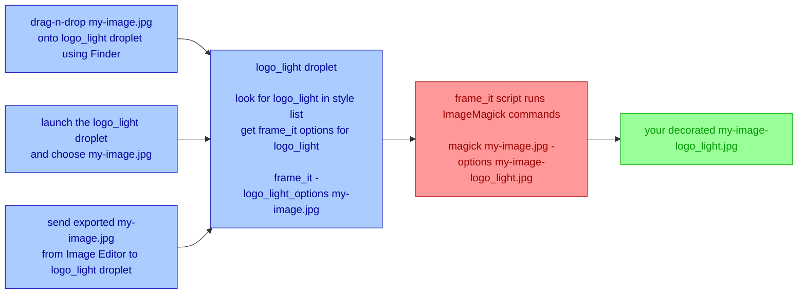

# Magick Frames

Are you looking for a faster, easier way of give your photography that impressive, professional look for your website, social media, and clients? Look for further! Magick Frames makes it fast and easy to add an optional picture frame, a 3-dimensional shadow, your own text or graphic logo, and a colorful or transparent matte around your photographs.

Best of all, you get this with a single drag-n-drop. Select your photographs, drop them onto your preferred style applet, and move on to other tasks. Magick Frames will style your photographs and place the decorated versions as new files in the same folder as the files your selected. Each style applet adds its style name to the output filename so you never lose your original. You can create as many different styled looks as you want for any image, each with their own output file, and always have access to your original file.

Here are the many features you get with Magick Frames:

- you choose whether or not to add a picture frame around your photographs
- you choose between a shadow box surround or a drop shadow for that 3-dimensional look
- you choose a two-row text logo or any graphic logo to affix below or on your photographs
- you choose where on your photographs you want your text or graphic logo to appear
- you choose any background matte color including transparent for your photographs
- you choose any color and font for your text-based logo
- your text and graphic logos are scaled to each photograph's size and orientation
- you get over 50 different style presets installed as macOS applets for fast, easy use
- easily craft your own custom style presets and create your own macOS applets
- all style applets are macOS apps - drag-n-drop photographs, or double-click and choose
- create multiple Capture One Export recipes on macOS and style your photographs on export
- use the StyleChooser applet to apply any or all of the presets to your selected photographs

You can download and set up Magick Frames in 5-10 minutes.

# Assistance and Support

If you need help, submit a request at my [1-on-1 support page on Buy Me A Coffee [dot] com](https://buymeacoffee.com/walterrowe/extras).

If you want to support Magick Frames, make a donation and [buy me a coffee](https://buymeacoffee.com/walterrowe).

# Assumptions

You will need to open a Terminal window to type in commands at a command prompt. You will have to install the ImageMagick open source software suite, and edit and copy a script. macOS users have to run an AppleScript to create the style droplets.

If these are unfamiliar terms, use my [1-on-1 support page on Buy Me A Coffee [dot] com](https://buymeacoffee.com/walterrowe/extras) to set up a one-on-one video call. I have decades of experience helping users.

# How Magick Frames Works

The Magick Frames package includes a shell script I wrote called "frame\_it". This shell script uses a free software suite called [ImageMagick](https://imagemagick.org/) to add a picture frame, add a pleasing outer shadow, place a logo or text below or at a specified inside edge of the image, and add a light or dark matte all the way around the edges to create a professional presentation for your photography. This "frame\_it" script hides the complexities of using ImageMagick so you don't have to learn them. This script is where all the "**magick**" happens. You can use this script directly from a command prompt on macOS and Linux. All of the script options are described at the bottom of this page and are displayed if you run "frame\_it" script with no options. The "frame_\it" script by default saves decorated images in a new file with "-frame" inserted before the file extension.

The Magick Frames package also includes an AppleScript that creates macOS "droplets". These droplets make it easy for macOS users to run the "frame\_it" script with specific options. The CreateStyleDroplets AppleScript contains a list of "styles" I developed to produce different looks. The style list includes style names and corresponding command line options for the "frame\_it" script. Opening and running the CreateStyleDroplets script in macOS Script Editor will create droplets for all of the styles defined in the script. Each droplet will be named for the styled look it produces. When one of these style-named droplets runs it looks for its name in the style list and uses the associated options with the "frame\_it" shell script to decorate your images.

These style-named droplets work like any other macOS application. You can drag-n-drop image files into them, double-click them and choose files, or name them in the export settings of image editing tools that support opening exported images with other applications. The style-named droplets save the decorated images in a new file with "-{style name}" inserted before the file extension. This lets you choose multiple styles and each is saved in a separate file.

This diagram illustrates what Magick Frames is doing, but users of the droplets won't see all if this. They will simply drag-n-drop files onto the droplet or double-click the droplet and choose files. The droplet will handle everything else that this diagram illustrates. 



The style droplets only runs on macOS. The ImageMagick tools and “frame\_it” shell script run on macOS and Linux.

By default the “frame\_it” shell script preserves your input file by saving the decorated image to a new output file with “-framed” inserted  before the extension in the output filename. An input file named `my-image.jpg` will have an output a file named `my-image-framed.jpg`. The droplets use their style name in place of "framed" for the output file name. The output file is always placed in the same folder as the input file. You can tell the shell script to overwrite your input file by adding the `-o` or `--overwrite` option.

The “frame\_it” shell script offers numerous options to tailor the style of decoration around your images. The CreateStyleDroplets AppleScript includes a list of predefined styles and associated options (also documented below). See the command line options section at the end for a detailed description of these options.

# Installation and Configuration

## Create Logo Watermarks

My logo image file is made with these specifications based on a 3000w x 2400h pixel image file:

- 900 pixels wide and 250 pixels tall
- use a transparent background
- save your logo image files as PNG files
- make a light colored logo for dark mattes and image areas (`watermark_light.png`)
- make a dark colored logo for light mattes and image areas (`watermark_dark.png`)
- place your logos in your Pictures folder
- DEFAULT: the default watermark logo filename in `frame_it` is `~/Pictures/watermark_dark.png`

## Install ImageMagick

Use the installation instructions on the [ImageMagick](https://imagemagick.org/) website. The package is available for macOS and many distributions of Linux.

## Install The Shell Script

Use a text editor to edit the [frame_it](frame_it) shell script. You need to set the values for your text-based logo (called `label1` and `label2`), and the location and file name for your default graphic logo file (`watermark`). Look for these lines in the “frame_it” shell script.

```shell
# text option - two text label lines
label1=“W  A  L  T  E  R     R  O  W  E     P  H  O  T  O  G  R  A  P  H  Y”
label2=“w w w . w a l t e r r o w e . c o m”

# default logo watermark file - graphic watermark (my logo watermark is 900wx250h pixels w/ transparent background)
watermark=~/Pictures/watermark_dark.png
```

Change value after the “=“ sign for “label1” and “label2” to your desired text. Change the value after the “=“ for “watermark” to the folder and filename for your default logo image file.

Copy the edited [frame_it](frame_it) shell script into your system’s /usr/local/bin folder.

After installing ImageMagick and copying your edited “frame\_it” to /usr/local/bin, you need to test “frame\_it”. You will need a test image to use for this. Open a Terminal window to test the “frame\_it” script to ensure it can access the ImageMagick tools.

```shell
% frame_it my-image.jpg
```

You should see an output file such as `my-image-framed.jpg` in the folder containing your test image.

If the “frame\_it” script says it cannot find the `identify` or `magick` command, this indicates that the folder containing the ImageMagick tools is not in the script’s environment path. Locate the directory containing the ImageMagick tools, then edit the “frame\_it” script and look for these lines. Here you will add the folder containing the ImageMagic tools so the script can find them.

```shell
# ADD IMAGEMAGICK BINARY PATH HERE and uncomment
# export PATH=/path/to/your/imagemagick:$PATH
```

In the line above containing `export`, replace `/path/to/your/imagemagick` with the folder containing the ImageMagick tools, uncomment the line (remove the `# ` at the beginning), and re-save the file. You will need to re-copy the script to the /usr/local/bin folder.

## Create The Style Droplets

The style droplets work on macOS only. Each style droplet is a macOS app that lets you:

- drag-n-drop files onto the droplet using Finder to decorate the selected files
- double-click the droplet to open a file chooser and decorate the selected files
- add to an export recipe of an image editing tool to decorate images on export

There are two ways to create the droplets for macOS.

1. EASY: Open the CreateStyleDroplets AppleScript in Script Editor and run it. Choose the folder where you want the droplets and it creates one for every style.
1. Open the CreateStyleDroplets AppleScript in Script Editor and export as individual apps named for specific styles.

When a style droplet runs it looks for it's own name in the styles property list and runs the “frame\_it” script with the associated options to decorate your images. For example, if you double-click the logo_dark droplet, it looks for logo_dark in the style list and uses the logo_dark "frame_it" options to decorate your images.

**StyleChooser**: One special droplet called "StyleChooser" is also created if you use the EASY option . When you double-click "StyleChooser" or drop images onto it, it presents a list of all the defined styles and lets you choose as many of them as you like. Let makes it easy to decorate a select set of pictures in multiple styles at once. If you have added your own custom styles to run CreateStyleDroplets to create all the defined styles, then StyleChooser also offers your custom styles.

### Create Individual Style Droplets

You can create individual style droplets for only the styles you want to use.

1. Open CreateStyleDroplets.applescript script in the macOS Script Editor
1. Look at the `styleDroplets` property of included styles and their associated options
1. Use File > Export, choose type Application, and save a droplet as each of your desired style names

When you drop images onto or double-click a droplet named for one of the included styles, it decorates images in that named style.

SPEED TIP: Once you create one droplet, use Finder to copy-n-paste as names of other defined styles. This is faster than exporting the script multiple times from the AppleScript Script Editor.

### Included Styles

Below is a list of all the styles included in the script and their options. See the command line section at the bottom for a complete description of all the supported options.

**NOTE**: the included styles preserve the source image. Edit the StyleDroplet AppleScript and add option `-o` or `--overwrite` to overwrite the source.

- styles with `text` in the name use the two-row text-based labels for watermarking
- styles with `logo` in the name use the image-based logo for watermarking (logo-based is the default)
- styles with `over` in the name place the text or logo "over" (inside) the image (centered below is the default)
- styles with `drop` in the name use a drop-shadow vs shadow on all edges (all edges is the default)
- styles with `pic` in the name add the picture frame to the images (no picture frame is the default)
- styles with `light` in the name use a light background (matte color) (light matte color is the default)
- styles with `dark` in the name use a dark background (matte color)
- styles with `transparent` in the name use a transparent background (matte color) allowing broader use
- styles with `-g` use this "gravity" option to specify where inside them image (see `gravity` in "frame_it" options)
- styles with a `watermark_light.png` use a transparent watermark with light logo for dark backgrounds
- styles with a `watermark_dark.png` use a transparent watermark with dark logo for light backgrounds

**Logo Inside Image, White Background, Light Logo (assumes logo goes in dark image area)**

- logo_light_over: -ol -mc=#ffffff -g=southeast -w=~/Pictures/watermark_light.png
- logo_light_over_drop: -ol -d -mc=#ffffff -g=southeast -w=~/Pictures/watermark_light.png
- logo_light_over_pic: -ol -p -mc=#ffffff -g=southeast -w=~/Pictures/watermark_light.png
- logo_light_over_drop_pic: -ol -d -p -mc=#ffffff -g=southeast -w=~/Pictures/watermark_light.png

**Logo Inside Image, Gray Background, Light Logo (assumes logo goes in dark image area)**

- logo_dark_over: -ol -mc=#383838 -g=southeast -w=~/Pictures/watermark_light.png
- logo_dark_over_drop: -ol -d -mc=#383838 -g=southeast -w=~/Pictures/watermark_light.png
- logo_dark_over_pic: -ol -p -mc=#383838 -g=southeast -w=~/Pictures/watermark_light.png
- logo_dark_over_drop_pic: -ol -d -p -mc=#383838 -g=southeast -w=~/Pictures/watermark_light.png

**Logo Below Image, White Background, Dark Logo (for light matte color below image)**

- logo_light: -l -mc=#ffffff -w=~/Pictures/watermark_dark.png
- logo_light_drop: -l -d -mc=#ffffff -w=~/Pictures/watermark_dark.png
- logo_light_pic: -l -p -mc=#ffffff -w=~/Pictures/watermark_dark.png
- logo_light_drop_pic: -l -d -p -mc=#ffffff -w=~/Pictures/watermark_dark.png

**Logo Below Image, Gray Background, Light Logo (for dark matte color below image)**

- logo_dark: -l -mc=#383838 -w=~/Pictures/watermark_light.png
- logo_dark_drop: -l -d -mc=#383838 -w=~/Pictures/watermark_light.png
- logo_dark_pic: -l -p -mc=#383838 -w=~/Pictures/watermark_light.png
- logo_dark_drop_pic: -l -d -p -mc=#383838 -w=~/Pictures/watermark_light.png

**Text Inside Image, White Background, Light Text (assumes text goes in dark image area)**

- text_light_over: -ot -mc=#ffffff -g=south -d -tc=#E0E0E0
- text_light_over_drop: -ot -d -mc=#ffffff -g=south -d -tc=#E0E0E0
- text_light_over_pic: -ot -p -mc=#ffffff -g=south -d -tc=#E0E0E0
- text_light_over_drop_pic: -ot -d -p -mc=#ffffff -g=south -d -tc=#E0E0E0

**Text Inside Image, Gray Background, Light Text (assumes text goes in dark image area)**

- text_dark_over: -ot -mc=#383838 -g=south -d -tc=#E0E0E0
- text_dark_over_drop: -ot -d -mc=#383838 -g=south -d -tc=#E0E0E0
- text_dark_over_pic: -ot -p -mc=#383838 -g=south -d -tc=#E0E0E0
- text_dark_over_drop_pic: -ot -d -p -mc=#383838 -g=south -d -tc=#E0E0E0

**Text Below Image, White Background, Dark Text (for light matte color below image)**

- text_light: -t -mc=#ffffff -tc=#383838
- text_light_drop: -t -d -mc=#ffffff -tc=#383838
- text_light_pic: -t -p -mc=#ffffff -tc=#383838
- text_light_drop_pic: -t -d -p -mc=#ffffff -tc=#383838

**Text Below Image, Gray Background, Light Text (for dark matte color below image)**

- text_dark: -t -mc=#383838 -tc=#E0E0E0
- text_dark_drop: -t -d -mc=#383838 -tc=#E0E0E0
- text_dark_pic: -t -p -mc=#383838 -tc=#E0E0E0
- text_dark_drop_pic: -t -d -p -mc=#383838 -tc=#E0E0E0

### Create Custom Styles

**WARNING**: You MUST use Script Editor to add custom styles. The `styleDroplets` property list uses OPT+[RETURN] to continue the list across multiple lines. Other code editing tools such as Visual Studio Code and Atom are unable to insert this special form of line continuation.

If you feel comfortable with the AppleScript Script Editor, you can add your own styles to the style list. You will see entries for "formatting". These are simply fillers to make it easier to read and group together the defined styles with similar looks.

The property list uses `key:value` pairs where the style name is the key and the “frame\_it” style options is the value. Use “frame\_it” from the command line to test different options and develop your own custom style settings. Run “frame\_it” with NO options to see a complete list of style options. Once you have an options set you like, add a new entry to the property list with unique name and the options you choose, and export a new droplet named for your custom style(s).

```applescript
	{your_style_name:"-your -style -options"} & ¬
```

When you drop files onto or double-click the `logo_dark_over_drop` droplet, the droplet will construct a separate shell command line for each image file as follows:

```text
% frame_it -ol -d -mc=#383838 -g=southeast -w=~/Pictures/watermark_light.png <your image file>
```

This is the `styleDroplets` property list included in the CreateStyleDroplets script that represent all of the included styles described above.

```applescript
property styleDroplets : {formatting:"filler"} & ¬
	{logo_light:"-l -mc=#ffffff -w=~/Pictures/watermark_dark.png"} & ¬
	{logo_light_drop:"-l -d -mc=#ffffff -w=~/Pictures/watermark_dark.png"} & ¬
	{logo_light_pic:"-l -p -mc=#ffffff -w=~/Pictures/watermark_dark.png"} & ¬
	{logo_light_drop_pic:"-l -d -p -mc=#ffffff -w=~/Pictures/watermark_dark.png"} & ¬
	{formatting:"filler"} & ¬
	{logo_light_over:"-ol -mc=#ffffff -g=southeast -w=~/Pictures/watermark_light.png"} & ¬
	{logo_light_over_drop:"-ol -d -mc=#ffffff -g=southeast -w=~/Pictures/watermark_light.png"} & ¬
	{logo_light_over_pic:"-ol -p -mc=#ffffff -g=southeast -w=~/Pictures/watermark_light.png"} & ¬
	{logo_light_over_drop_pic:"-ol -d -p -mc=#ffffff -g=southeast -w=~/Pictures/watermark_light.png"} & ¬
	{formatting:"filler"} & ¬
	{logo_dark:"-l -mc=#383838 -w=~/Pictures/watermark_light.png"} & ¬
	{logo_dark_drop:"-l -d -mc=#383838 -w=~/Pictures/watermark_light.png"} & ¬
	{logo_dark_pic:"-l -p -mc=#383838 -w=~/Pictures/watermark_light.png"} & ¬
	{logo_dark_drop_pic:"-l -d -p -mc=#383838 -w=~/Pictures/watermark_light.png"} & ¬
	{formatting:"filler"} & ¬
	{logo_dark_over:"-ol -mc=#383838 -g=southeast -w=~/Pictures/watermark_light.png"} & ¬
	{logo_dark_over_drop:"-ol -d -mc=#383838 -g=southeast -w=~/Pictures/watermark_light.png"} & ¬
	{logo_dark_over_pic:"-ol -p -mc=#383838 -g=southeast -w=~/Pictures/watermark_light.png"} & ¬
	{logo_dark_over_drop_pic:"-ol -d -p -mc=#383838 -g=southeast -w=~/Pictures/watermark_light.png"} & ¬
	{formatting:"filler"} & ¬
	{text_light:"-t -mc=#ffffff -tc=#383838"} & ¬
	{text_light_drop:"-t -d -mc=#ffffff -tc=#383838"} & ¬
	{text_light_pic:"-t -p -mc=#ffffff -tc=#383838"} & ¬
	{text_light_drop_pic:"-t -d -p -mc=#ffffff -tc=#383838"} & ¬
	{formatting:"filler"} & ¬
	{text_light_over:"-ot -mc=#ffffff -g=south -d -tc=#E0E0E0"} & ¬
	{text_light_over_drop:"-ot -d -mc=#ffffff -g=south -d -tc=#E0E0E0"} & ¬
	{text_light_over_pic:"-ot -p -mc=#ffffff -g=south -d -tc=#E0E0E0"} & ¬
	{text_light_over_drop_pic:"-ot -d -p -mc=#ffffff -g=south -d -tc=#E0E0E0"} & ¬
	{formatting:"filler"} & ¬
	{text_dark:"-t -mc=#383838 -tc=#E0E0E0"} & ¬
	{text_dark_drop:"-t -d -mc=#383838 -tc=#E0E0E0"} & ¬
	{text_dark_pic:"-t -p -mc=#383838 -tc=#E0E0E0"} & ¬
	{text_dark_drop_pic:"-t -d -p -mc=#383838 -tc=#E0E0E0"} & ¬
	{formatting:"filler"} & ¬
	{text_dark_over:"-ot -mc=#383838 -g=south -d -tc=#E0E0E0"} & ¬
	{text_dark_over_drop:"-ot -d -mc=#383838 -g=south -d -tc=#E0E0E0"} & ¬
	{text_dark_over_pic:"-ot -p -mc=#383838 -g=south -d -tc=#E0E0E0"} & ¬
	{text_dark_over_drop_pic:"-ot -d -p -mc=#383838 -g=south -d -tc=#E0E0E0"} & ¬
	{formatting:"filler"}
```

Carefully follow the instructions above the `styleDroplets` style list inside the CreateStyleDroplets script. Use the instructions above to create droplets for individual styles for all the styles including your own custom styles. Custom style droplets should produce the same behavior as the included styles.

# How To Use

The scaling and placement of logos and text were developed using an image with dimensions 3000 wide by 2400 high pixels, a font of 64 points, and an image logo with dimensions 900 wide by 250 high pixels. When creating your own logo make one with dark text for light backgrounds and another with light text for dark backgrounds.

## In macOS Finder

The AppleScript droplet included with this package works like any other macOS application.

- drag-n-drop files onto the droplet using Finder to decorate the selected files
- double-click the droplet to open a file chooser and decorate the selected files
- add to an export recipe of an image editing tool to decorate images on export

The droplet name controls how the selected images are decorated as described above. The "StyleChooser" droplet will open a dialog where you can select one or more styles. The images will be decorated in the selected style(s) and each output filename will have the specific style's name inserted before the file extension.

## In Capture One Export Recipes

The droplet included with this package can configured into a Capture One Pro Export Recipe like any other application.

1. Go to `Open With` field in a Capture One Export Recipe
1. Choose `Other` from the `Open With` drop-down menu
1. Navigate to and select one of your droplet applications
1. Select and check the configured Export Recipe
1. Select images to export and press `CMD + D` or the Export button

The droplet name controls how the exported images are decorated.

This is what really happens is on export.

1. The Export Recipe exports your selected images to your designated folder
1. The Export Recipe passes each output filename to the droplet named in "Open with"
1. The droplet passes the correct options and output filename to the “frame\_it” shell script
1. The “frame\_it” shell script decorates your output file using the chosen “frame\_it” options

This process may seem complicated, but it works quickly and invisibly. Open your output folder in Finder icon view before you export, watch as the exported files appear in the folder, and then notice the previews change as they are decorated by “frame\_it”.

## At The Command Line

The [frame_it](frame_it) shell script can be used from the command line on macOS and Linux.

DEFAULTS: When no options are provided, the default behavior is:

- center the image over a shadow on light background
- do not apply a picture frame around the image
- place an image-based logo beneath the image
- write the decorated output to a separate file

Place the [frame_it](frame_it) shell script in /usr/local/bin and run it with no options to see a usage message showing all of the available styling options.

```text
usage: frame_it [ OPTIONS ] image [ .. ]

OPTIONS:

-h | --help               display a usage message with option descriptions

-o | --overwrite          specifies to overwrite the original files vs the default
                          of keeping them and writing new files with "-framed" inserted
                          before the suffix

-s=suffix |               suffix to append to decorated file names (default: "-framed")
--suffix=suffix

-t | --text               specifies to use a two-line text logo underneath the image

-ot | --overlaytext       specifies to use a two-line text logo inside the image

-tc=color |               specifies the color of the two-line text logo
--textcolor=color         default #383838 below image, #E0E0E0 inside image

-l | --logo               specifies to place an image-based logo underneath the image
                          DEFAULT style when no options are specified

-ol | --overlaylogo       specifies to place an image-based logo inside the image


-d | --dropshadow         specifies a drop shadow (offset bottom and right) vs
                          the default that centers the image in an all-edges shadow

-p | --picture            add a 1-pixel black inner border + 10-pixel white outer border

-f=font |                 specify the font to use for the two-row label text logo
--font=font
-mc=color |               specifies the color of the matte background (default white)
--mattecolor=color

-w=your_logo |            specifies the image-based logo to use as the watermark that
--watermark=your_logo     that is placed below or inside the image.

-g=placement |            specifies which inside edge or corner of the image the logo
--gravity=placement       or text should be nearest. The following are accepted values.
                          The logo or text is inset from the specified edge or corner.
                          DEFAULT edge is south/bottom.

                            +----------------------------------------------------+
                            | topleft               top                 topright |
                            |                                                    |
                            | left                 middle                  right |
                            |                                                    |
                            | bottomleft           bottom            bottomright |
                            +----------------------------------------------------+

                            +----------------------------------------------------+
                            | northwest            north               northeast |
                            |                                                    |
                            | west                 center                   east |
                            |                                                    |
                            | southwest            south               southeast |
                            +----------------------------------------------------+
```

Make test copies of image files and use the shell script from the command line to experiment with how different styles decorate your test images. This will help you choose which options you want to use in your droplet(s).

You can see the names of fonts from which to choose for text-based labels using this command. In the output you will see lines beginning with "Font"

```text
% magick -list font

... lots of output
  Font: Academy-Engraved-LET-Plain:1.0
    family: Academy Engraved LET
    style: Normal
    stretch: Normal
    weight: 400
    glyphs: /System/Library/Fonts/Supplemental/Academy Engraved LET Fonts.ttf
...
```

If you want to use font "Academy Engraved LET" for a text-based logo then you would specify it as follows on the command line.

```
frame_it -t -f=Academy-Engraved-LET-Plain:1.0 my-image.jpg
```

Note the `-t` option to specify a text-based logo.