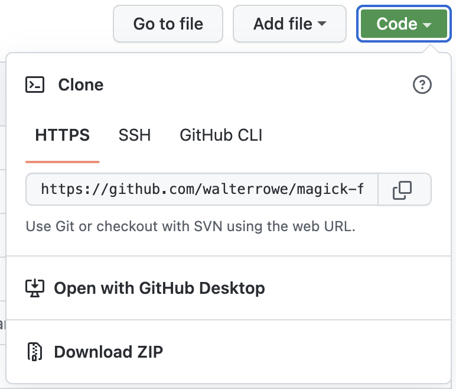
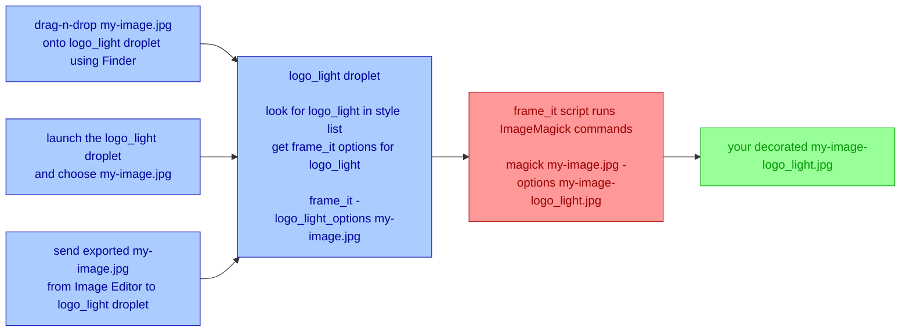

# Magick Frames

Are you looking for a faster, easier way of give your photography that impressive, professional look for your website, social media, and clients? Look no further!

Magick Frames makes it fast and easy to add an optional picture frame, a 3-dimensional shadow, your own text or graphic logo, and a colorful or transparent matte around your photographs. Best of all, you get this with a single drag-n-drop.

Select your photographs, drop them onto your preferred style applet, and move on to other tasks. Magick Frames will style your photographs and place the decorated versions as new files in the same folder as the files you selected. Each style applet adds its style name to the output filename. This makes it easy to identify what style was used. You can create as many different styled looks as you want for any image, each with their own output file, and always have access to your original file.

Here are the many features you get with Magick Frames:

- add a picture frame around your photographs
- choose a shadowbox, a drop shadow, or **(NEW) matte bevel** for that 3-D look
- apply a two-row text logo or any graphic logo to your photographs
- place any graphic logo at designated locations below, on, **(NEW) above**
- place your text logo at designated locations on **(NEW) or below** your image
- choose colors (or "transparent") for matte, **(NEW) - bevel, frame, wall picture frame, shadow**
- choose color and font for your text-based logo
- **(NEW) choose any aspect ratio for your output file (filled using matte color)**
- **(NEW) choose to add a wall picture frame to the outer edge of your image**
- text and graphic logos are scaled to each photograph's size and orientation
- over 60 different style presets installed as macOS droplets for fast, easy use
- easily craft your own custom styles and corresponding macOS style applets
- all style droplets are apps - drag-n-drop onto them, double-click them and choose
- create multiple Capture One Export recipes and style your photographs on export
- use the Style Chooser to apply multiple styles to selected images in a single action

You can download and set up Magick Frames in 5-10 minutes.

# Assistance and Support

If you need help, submit a request at my [1-on-1 support page on Buy Me A Coffee [dot] com](https://buymeacoffee.com/walterrowe/extras).

If you want to support Magick Frames, [make a donation and buy me some coffee](https://buymeacoffee.com/walterrowe).

# Assumptions

You will need to open a Terminal window to type in commands at a command prompt. You will have to install the ImageMagick open source software suite, and edit and copy a script. macOS users have to run an AppleScript to create the style droplets.

If these are unfamiliar terms, use my [1-on-1 support page on Buy Me A Coffee [dot] com](https://buymeacoffee.com/walterrowe/extras) to set up a one-on-one video call. You will be using Magick Frames in no time.

# Upgrading Magick Frames

This update includes new and changed options for "frame\_it" for even more style tailoring choices.

- (NEW) With option `-a` you can choose a specific aspect ratio for your output file (fills in with matte color).
- (NEW) With option `-b` you can choose a bevel between the picture and matte.
- (NEW) With option `-bc=color` you can choose a "bevel color" for your bevel.
- (CHANGE) With option `-f` you can add a print frame around your picture (formerly `-p`).
- (NEW) With option `-fc=color` you can choose a "frame color" other than white.
- (CHANGE) With option `-g` now you can place your logo anywhere above or below the picture.
- (CHANGE) With option `-g` now you can place your text bottom left, bottom center, or bottom right below the picture.
- (NEW) With option `-p` now you can add an extra matte and wall frame as the outer border to your picture.
- (NEW) With option `-pc=color` you can choose a "wall frame color" for your wall picture frame.
- (NEW) With option `-sc=color` you can choose a "shadow color" for your shadows.
- (CHANGE) With option `-tf` you can choose an alternate font for text based logos.
- (CHANGE) Separated styles into "presetDroplets" and "customDroplets" property lists in CreateStyleDroplets.

Before you upgrade preserve your modified "frame\_it" and CreateStyleDroplet scripts.

1. Save a copy of your "frame\_it" script to set your labels, watermark, and custom path setting in the new version.
1. Save a copy of your CreateStyleDroplets AppleScript to copy your custom styles to the new CreateStyleDroplets.
1. The option for specifying a text font has changed from "-f" to "-tf" for "text font".
1. The option for adding a picture frame has changed from "-p" to "-f" for "frame".

You are now ready to update.

1. Download Magick Frames again from GitHub.
1. Set your "label1", "label2", watermark, and custom path values in "frame\_it"
1. Copy the new version of "frame\_it" it to /usr/local/bin folder.
1. Copy your saved custom styles into the new CreateStyleDroplets AppleScript.
1. Change any custom styles that add a frame to use "-f" instead of "-p".
1. Run the CreateStyleDroplets AppleScript to recreate all the style droplets.
1. Check any Capture One export recipes to make sure they still see your droplets.

You should now be upgraded to the latest version.

# Installation and Configuration

First you have to download Magick Frames to your computer.

1. On the Magick Frames GitHub page press the green "Code" button.
1. On the Code drop-down press choose the option to "Download ZIP".



The default download folder is "Downloads", but you can change that if you have configured your browser to ask. On your computer you may have to double-click the ZIP file in Finder to extract it into its own folder.

## Create Logo Watermarks

These graphic logo specifications are based on sizing for a 3000w x 2400h pixel image file:

- create a logo folder (e.g. Pictures/watermarks) and place your logos there
- create your logo files and save them as PNG files in your logos folder
- size your logos 1400 pixels wide and 500 pixels tall with a transparent background
- make a light colored logo to use on dark mattes and place on dark images (`watermark_light.png`)
- make a dark colored logo to use on light mattes and place on light images (`watermark_dark.png`)
- DEFAULT: the default graphic logo file is in "Pictures/watermarks/watermark_dark.png"

You can create many different graphic logos. Always create two for each style - one dark and one light.

## Install ImageMagick on macOS

Use these installation instructions (from the [ImageMagick](https://imagemagick.org/) website). The package is available for macOS and many distributions of Linux.

Open a Terminal window and copy/paste or type these commands:

1. Install HomeBrew (this may ask for your password .. that is OK)

    ```shell
    % /bin/bash -c "$(curl -fsSL https://raw githubusercontent.com/Homebrew/install/HEAD/install.sh)"
    ```

1. Install ImageMagick

    ```shell
	% brew install imagemagick
	```

Linux users can download the package from the ImageMagick website and follow their instructions for installation.

## Install The Shell Script

Use a text editor to edit the [frame_it](frame_it) shell script. You need to set the values for your text-based logo (called `label1` and `label2`), and the location and file name for your default graphic logo file (`watermark`). Look for these lines in the “frame_it” shell script.

```shell
# text option - two text label lines
label1=“W  A  L  T  E  R     R  O  W  E     P  H  O  T  O  G  R  A  P  H  Y”
label2=“w w w . w a l t e r r o w e . c o m”

# default logo watermark file - graphic watermark (my logo watermark is 900wx250h pixels w/ transparent background)
watermark=$HOME/Pictures/watermarks/watermark_dark.png
```

Change value after the “=“ sign for “label1” and “label2” to your desired text. Change the value after the “=“ for “watermark” to the folder and filename for your default logo image file.

Copy the edited [frame_it](frame_it) shell script into your system’s /usr/local/bin folder.

After installing ImageMagick and copying your edited “frame\_it” to /usr/local/bin, you need to test “frame\_it”. You will need to use one of your images for testing.

1. Copy a JPG picture to your Desktop and call it "my-image.jpg".
1. Keep your Desktop folder open in Finder.
1. Open a Terminal window and type the following commands.

    ```shell
    % cd $HOME/Desktop
    % frame_it my-image.jpg
    ```

You should see a new file in your Desktop Finder window called `my-image-framed.jpg`. This confirms everything is working and you can skip to Create The Style Droplets.

If the “frame\_it” script says it cannot find the `identify` or `magick` command, this indicates that the folder containing the ImageMagick tools is not in the script’s environment path. Locate the directory containing the ImageMagick tools, then edit the “frame\_it” script and look for these lines. Here you will add the folder containing the ImageMagic tools so the script can find them.

```shell
# ADD IMAGEMAGICK BINARY PATH HERE and uncomment
# export PATH=/path/to/your/imagemagick:$PATH
```

In the line above containing `export`, replace `/path/to/your/imagemagick` with the folder containing the ImageMagick tools, uncomment the line (remove the `# ` at the beginning), and re-save the file. You will need to re-copy the script to the /usr/local/bin folder.

## Create The Style Droplets

</img>

The style droplets created on macOS are little apps that work like you expect:

- drag-n-drop files onto the droplet using Finder to decorate the selected files
- double-click the droplet to open a file chooser and decorate the selected files
- add to an export recipe of an image editing tool to decorate images on export

There are two ways to create the droplets for macOS.

### The Easy Way

1. Open the CreateStyleDroplets AppleScript in Script Editor and run it.
1. Choose the folder where you want the droplets and it creates one for every style.

> &nbsp;
> **Bonus Feature**
>
> When you use this EASY option one SPECIAL style droplet is also created called "**Style Chooser**".
>
> Double-click "Style Chooser" or drop images onto it and it presents a list of all the defined styles. Select multiple styles to easily decorate a set of pictures in multiple looks in one easy step.
>
> If you have added your own custom styles to the CreateStyleDroplets AppleScript, and recreated all the style droplets, then Style Chooser also includes your own custom styles.
> &nbsp;

### The Hard Way

1. Open the CreateStyleDroplets AppleScript in Script Editor.
1. Look at the `styleDroplets` property of included styles and their associated options.
1. File > Export, choose type Application, and save a droplet named as a desired style.

When a style droplet runs it looks for it's own name in the styles property list and runs the “frame\_it” script with the associated options to decorate your images. For example, if you double-click or drop images onto the the logo_dark droplet, it looks for logo_dark in the style list and passes the logo_dark options to "frame_it" to decorate your images.

Once you have the style droplets created you are ready to use Magick Frames.

# How To Use

The scaling and placement of logos and text were developed using an image with dimensions 3000 wide by 2400 high pixels, a font of 64 points, and an image logo with dimensions 900 wide by 250 high pixels. When creating your own logo make one with dark text for light backgrounds and another with light text for dark backgrounds.

## In macOS Finder

The AppleScript droplet included with this package works like any other macOS application.

- drag-n-drop files onto the droplet using Finder to decorate the selected files
- double-click the droplet to open a file chooser and decorate the selected files
- add to an export recipe of an image editing tool to decorate images on export

The droplet name controls how the selected images are decorated as described above. The "StyleChooser" droplet will open a dialog where you can select one or more styles. The images will be decorated in the selected style(s) and each output filename will have the specific style's name inserted before the file extension.

## In Capture One Export Recipes

The droplet included with this package can configured into a Capture One Pro Export Recipe like any other application.

1. Go to `Open With` field in a Capture One Export Recipe
1. Choose `Other` from the `Open With` drop-down menu
1. Navigate to and select one of your droplet applications
1. Select and check the configured Export Recipe
1. Select images to export and press `CMD + D` or the Export button

The droplet name controls how the exported images are decorated.

This is what really happens is on export.

1. The Export Recipe exports your selected images to your designated folder
1. The Export Recipe passes each output filename to the droplet named in "Open with"
1. The droplet passes the correct options and output filename to the “frame\_it” shell script
1. The “frame\_it” shell script decorates your output file using the chosen “frame\_it” options

This process may seem complicated, but it works quickly and invisibly. Open your output folder in Finder icon view before you export, watch as the exported files appear in the folder, and then notice the previews change as they are decorated by “frame\_it”.

## At The Command Line

The [frame_it](frame_it) shell script can be used from the command line on macOS and Linux.

Place the [frame_it](frame_it) shell script in /usr/local/bin and run it with no options to see a usage message showing all of the available styling options.

```text
usage: frame_it [ OPTIONS ] image [ .. ]

OPTIONS:

-h | --help               display a usage message with option descriptions

-o | --overwrite          specifies to overwrite the original files vs the default
                          of keeping them and writing new files with "-framed" inserted
                          before the suffix

-s=suffix |               suffix to append to decorated file names (default: "-framed")
--suffix=suffix

-t | --text               specifies to use a two-line text logo underneath the image

-ot | --overlaytext       specifies to use a two-line text logo inside the image

-l | --logo               specifies to place an image-based logo underneath the image
                          DEFAULT style when no options are specified

-ol | --overlaylogo       specifies to place an image-based logo inside the image

-f | --frame              add a picture frame around the sides of the image
                          this disables bevel and enables shadowboxing (default no frame)

-b | --bevel              add an interior bevel between the image and surrounding matte.
                          this disables shadowboxing and picture frame. (default no bevel)

-p | --picture            add a wall picture frame outer border for that wall mounted look.
                          this disables shadowboxing and thin frame. (default no bevel)

-d | --dropshadow         specifies a drop shadow (offset bottom and right) vs
                          the default that centers the image in an all-edges shadow

-bc=color |               specifies the color of the interior bevel (default #888888)
--bevelcolor=color

-fc=color |               specifies the color of the inner picture frame (default white)
--framecolor=color

-mc=color |               specifies the color of the matte background (default white)
--mattecolor=color

-pc=color |               specifies the color of the wall picture frame (default #222222)
--picturecolor=color

-sc=color |               specifies the color of the shadow (default black)
--shadowcolor=color

-tc=color |               specifies the color of the two-line text logo
--textcolor=color         default #383838 below image, #E0E0E0 inside image

-tf=font |                specify the font to use for the two-row label text logo
--textfont=font

-a=ratio |                specify the desired aspect ratio of the final output file
--aspect=ratio            in x:y ratio format (eg. -a=3:2, -a=1:1). some social media
                          sites prefer specific aspect ratios for best display.

-w=your_logo |            specifies the image-based logo to use as the watermark that
--watermark=your_logo     that is placed below or inside the image.

-g=placement |            specifies which inside edge or corner of the image the logo
--gravity=placement       or text should be nearest. The following are accepted values.
                          The logo or text is inset from the specified edge or corner.
                          DEFAULT edge is south/bottom.

                            +----------------------------------------------------+
                            | topleft               top                 topright |
                            |                                                    |
                            | left                 middle                  right |
                            |                                                    |
                            | bottomleft           bottom            bottomright |
                            +----------------------------------------------------+

                            +----------------------------------------------------+
                            | northwest            north               northeast |
                            |                                                    |
                            | west                 center                   east |
                            |                                                    |
                            | southwest            south               southeast |
                            +----------------------------------------------------+
```

Make test copies of image files and use the shell script from the command line to experiment with how different styles decorate your test images. This will help you choose which options you want to use in your droplet(s).

You can see the names of fonts from which to choose for text-based labels using this command. In the output you will see lines beginning with "Font"

```text
% magick -list font

... lots of output
  Font: Academy-Engraved-LET-Plain:1.0
    family: Academy Engraved LET
    style: Normal
    stretch: Normal
    weight: 400
    glyphs: /System/Library/Fonts/Supplemental/Academy Engraved LET Fonts.ttf
...
```

If you want to use font "Academy Engraved LET" for a text-based logo then you would specify it as follows on the command line.

```
frame_it -t -tf=Academy-Engraved-LET-Plain:1.0 my-image.jpg
```

Note the `-t` option to specify a text-based logo.

# Examples

- Bevel with colored matte and logo overlaid on southwest corner of the image

    

- Shadowed print frame with graphic logo appearing above the picture

    

- Shadowed print frame with graphic logo appearing in southeast corner below the image

    

- Beveled matte with graphic logo above the picture and aspect ratio 1:1 (square)

    

- Beveled matte with text logo below the picture and aspect ratio 1:1 (square)

    

- Wall picture frame and matte with graphic logo below the picture

    

# Included Styles

The list below is the `presetDroplets` style list included in the CreateStyleDroplets script. It represent all of the included styles. See the command line section above for a complete description of all the options.

- The "presetDroplets" property list in CreateStyleDroplets is for included styles and should not be altered.
- The "customDroplets" property list in CreateStyleDroplets is for crafting your own styles for style droplets.
- The "{} & ¬" lines in the list are there only for readability.
- The "& ¬" characters in AppleScript are a way to join two lines together.

```applescript
property presetDroplets : {} & ¬
	{logo_transparent:"-l -mc=transparent -w=~/Pictures/watermarks/alander_dark.png"} & ¬
	{logo_transparent_drop:"-l -d -mc=transparent -w=~/Pictures/watermarks/alander_dark.png"} & ¬
	{logo_transparent_frame:"-l -f -mc=transparent -w=~/Pictures/watermarks/alander_dark.png"} & ¬
	{logo_transparent_drop_frame:"-l -d -f -mc=transparent -w=~/Pictures/watermarks/alander_dark.png"} & ¬
	{} & ¬
	{logo_transparent_over:"-ol -mc=transparent -g=southwest -w=~/Pictures/watermarks/alander_light.png"} & ¬
	{logo_transparent_over_drop:"-ol -d -mc=transparent -g=southwest -w=~/Pictures/watermarks/alander_light.png"} & ¬
	{logo_transparent_over_frame:"-ol -f -mc=transparent -g=southwest -w=~/Pictures/watermarks/alander_light.png"} & ¬
	{logo_transparent_over_drop_frame:"-ol -d -f -mc=transparent -g=southwest -w=~/Pictures/watermarks/alander_light.png"} & ¬
	{} & ¬
	{logo_light:"-l -mc=#ffffff -w=~/Pictures/watermarks/alander_dark.png"} & ¬
	{logo_light_drop:"-l -d -mc=#ffffff -w=~/Pictures/watermarks/alander_dark.png"} & ¬
	{logo_light_frame:"-l -f -mc=#ffffff -w=~/Pictures/watermarks/alander_dark.png"} & ¬
	{logo_light_drop_frame:"-l -d -f -mc=#ffffff -w=~/Pictures/watermarks/alander_dark.png"} & ¬
	{logo_light_picture:"-l -p -mc=#ffffff -w=~/Pictures/watermarks/alander_dark.png"} & ¬
	{} & ¬
	{logo_light_over:"-ol -mc=#ffffff -g=southwest -w=~/Pictures/watermarks/alander_light.png"} & ¬
	{logo_light_over_drop:"-ol -d -mc=#ffffff -g=southwest -w=~/Pictures/watermarks/alander_light.png"} & ¬
	{logo_light_over_frame:"-ol -f -mc=#ffffff -g=southwest -w=~/Pictures/watermarks/alander_light.png"} & ¬
	{logo_light_over_drop_frame:"-ol -d -f -mc=#ffffff -g=southwest -w=~/Pictures/watermarks/alander_light.png"} & ¬
	{} & ¬
	{logo_dark:"-l -mc=#383838 -w=~/Pictures/watermarks/alander_light.png"} & ¬
	{logo_dark_drop:"-l -d -mc=#383838 -w=~/Pictures/watermarks/alander_light.png"} & ¬
	{logo_dark_frame:"-l -f -mc=#383838 -w=~/Pictures/watermarks/alander_light.png"} & ¬
	{logo_dark_drop_frame:"-l -d -f -mc=#383838 -w=~/Pictures/watermarks/alander_light.png"} & ¬
	{logo_dark_picture:"-l -p -mc=#383838 -w=~/Pictures/watermarks/alander_light.png"} & ¬
	{} & ¬
	{logo_dark_over:"-ol -mc=#383838 -g=southwest -w=~/Pictures/watermarks/alander_light.png"} & ¬
	{logo_dark_over_drop:"-ol -d -mc=#383838 -g=southwest -w=~/Pictures/watermarks/alander_light.png"} & ¬
	{logo_dark_over_frame:"-ol -f -mc=#383838 -g=southwest -w=~/Pictures/watermarks/alander_light.png"} & ¬
	{logo_dark_over_drop_frame:"-ol -d -f -mc=#383838 -g=southwest -w=~/Pictures/watermarks/alander_light.png"} & ¬
	{} & ¬
	{text_transparent:"-t -mc=transparent -tc=#383838"} & ¬
	{text_transparent_drop:"-t -d -mc=transparent -tc=#383838"} & ¬
	{text_transparent_frame:"-t -f -mc=transparent -tc=#383838"} & ¬
	{text_transparent_drop_frame:"-t -d -f -mc=transparent -tc=#383838"} & ¬
	{} & ¬
	{text_transparent_over:"-ot -mc=transparent -g=south -d -tc=#E0E0E0"} & ¬
	{text_transparent_over_drop:"-ot -d -mc=transparent -g=south -d -tc=#E0E0E0"} & ¬
	{text_transparent_over_frame:"-ot -f -mc=transparent -g=south -d -tc=#E0E0E0"} & ¬
	{text_transparent_over_drop_frame:"-ot -d -f -mc=transparent -g=south -d -tc=#E0E0E0"} & ¬
	{} & ¬
	{text_light:"-t -mc=#ffffff -tc=#383838"} & ¬
	{text_light_drop:"-t -d -mc=#ffffff -tc=#383838"} & ¬
	{text_light_frame:"-t -f -mc=#ffffff -tc=#383838"} & ¬
	{text_light_drop_frame:"-t -d -f -mc=#ffffff -tc=#383838"} & ¬
	{text_light_picture:"-t -p -mc=#ffffff -tc=#333333"} & ¬
	{} & ¬
	{text_light_over:"-ot -mc=#ffffff -g=south -d -tc=#E0E0E0"} & ¬
	{text_light_over_drop:"-ot -d -mc=#ffffff -g=south -d -tc=#E0E0E0"} & ¬
	{text_light_over_frame:"-ot -f -mc=#ffffff -g=south -d -tc=#E0E0E0"} & ¬
	{text_light_over_drop_frame:"-ot -d -f -mc=#ffffff -g=south -d -tc=#E0E0E0"} & ¬
	{} & ¬
	{text_dark:"-t -mc=#383838 -tc=#E0E0E0"} & ¬
	{text_dark_drop:"-t -d -mc=#383838 -tc=#E0E0E0"} & ¬
	{text_dark_frame:"-t -f -mc=#383838 -tc=#E0E0E0"} & ¬
	{text_dark_drop_frame:"-t -d -f -mc=#383838 -tc=#E0E0E0"} & ¬
	{text_dark_picture:"-t -p -mc=#383838 -tc=#E0E0E0"} & ¬
	{} & ¬
	{text_dark_over:"-ot -mc=#383838 -g=south -d -tc=#E0E0E0"} & ¬
	{text_dark_over_drop:"-ot -d -mc=#383838 -g=south -d -tc=#E0E0E0"} & ¬
	{text_dark_over_frame:"-ot -f -mc=#383838 -g=south -d -tc=#E0E0E0"} & ¬
	{text_dark_over_drop_frame:"-ot -d -f -mc=#383838 -g=south -d -tc=#E0E0E0"} & ¬
	{}
```

There is a pattern to the preset style names.

- style names with `text` use a two-row text-based label logo for watermarking
- style names with `logo` use a graphic logo for watermarking (default is graphic logo)
- style names with `over` place the text or logo "over" (inside) the image (default is centered below)
- style names with `drop` use a drop-shadow vs shadow on all edges (defailt is all edges)
- style names with `frame` add a thin print-like border around images (default is no frame)
- style names with `bevel` add a thin beveled border around images (default is no bevel)
- style names with `picture` add a matte and wall picture frame around images (default is no picture frame)
- style names with `light` use a light background (matte color) (default is light matte)
- style names with `dark` use a dark background (matte color)
- style names with `transparent` use a transparent background (matte color) allowing broader use
- styles with `-g` use "gravity" to designate where to place text or logo (see "frame_it" options below)
- styles with `watermark_light.png` use a transparent watermark with light logo for dark backgrounds
- styles with `watermark_dark.png` use a transparent watermark with dark logo for light backgrounds

# Create Custom Styles

If you feel comfortable with the AppleScript Script Editor, you can add your own styles to the style list. You will see entries for "formatting". These are simply fillers to make it easier to read and group together the defined styles with similar looks.

DEFAULTS: When no options are provided to "frame\_it", the default behavior is:

- light matte background
- your picture centered over a shadowbox
- no picture frame around the image
- your graphic logo centered beneath the image
- styled version written to a separate file

> &nbsp;
> **WARNING**
>
> You MUST use Script Editor to add custom styles. The `customDroplets` property list uses OPT+[RETURN] to continue the list across multiple lines. Other code editing tools such as Visual Studio Code and Atom are unable to insert this special form of line continuation.
> &nbsp;

The property list uses `key:value` pairs where the style name is the key and the “frame\_it” options string is the value. Use “frame\_it” from the command line to test different options and develop your own custom style settings. Run “frame\_it” with NO options to see a complete list of style options. Once you have an options set you like, add a new entry to the property list with unique name and the options you choose, and export a new droplet named for your custom style(s).

```applescript
	{your_style_name:"-your -style -options"} & ¬
```

When you drop files onto or double-click the `logo_dark_over_drop` droplet, the droplet will construct a separate shell command line for each image file as follows:

```text
% frame_it -ol -d -mc=#383838 -g=southeast -w=~/Pictures/watermarks/watermark_light.png <your image file>
```

Here are some notes for creating your own styles with the "frame\_it" script options.

- The wall picture frame ("-p") and bevel ("-b") looks disable shadowboxing and thin inner frame.
- The wall picture frame ("-p") look always includes a bevel between the picture and the matte.
- Using "frame\_it" from the command line will accelerate developing your own custom styles.
- The [HTML Color Codes](https://htmlcolorcodes.com/color-picker/) page is great for picking colors for bevel, frame, matte, shadow, wall frame, and text.

The gravity ("-g") option offers great flexibility in placing your logo along the top, middle, or bottom. It uses compass direction terms to specify the location.

- Across the Top: `-g=northwest` OR `-g=north` OR `-g=northeast`
- Across the Middle: `-g=west` OR `-g=center` OR `-g=east`
- Across the Bottom: `-g=southwest` OR `-g=south` OR `-g=southeast`

Here are some useful tips for using gravity to place your logo.

- With logo styles ("-l") you can use the gravity ("-g") option to place the logo above or below the picture.
    - Centered Above or Below: `-g=north` OR `-g=south`
    - Any Corner Above/Below: `-g=northwest` OR `-g=northeast` OR `-g=southwest` OR `-g=southeast`
- With text styles ("-t") you can use the gravity ("-g") to place the logo above or below the picture.
    - Centered Below: `-g=south`
	- Either Corner Below: `-g=southwest` OR `-g=southeast`
- With the overlay styles ("-ol" and "-ot") you can use the gravity ("-g") option to place the logo anywhere on the picture.
    - Across the Top: `-g=northwest` OR `-g=north` OR `-g=northeast`
    - Across the Middle: `-g=west` OR `-g=center` OR `-g=east`
    - Across the Bottom: `-g=southwest` OR `-g=south` OR `-g=southeast`

There are two style lists in CreateStyleDroplets.

The `customDroplets` style list is formatted the same as the `presetDroplets` style list and appears directly below it in the CreateStyleDroplets script.

Carefully follow the instructions inside the CreateStyleDroplets script when adding or modifying style definitions. Any formatting errors will prevent the script from running properly.

- Use "The Easy Way" instructions to recreate all the style droplets including your own custom styles.
- Use "The Hard Way" instructions to create style droplets of only your custom styles.

Regardless of how you create them, your custom style droplets behave the same as the included styles droplets.

# How Magick Frames Works

This section is primarily for those who want to understand the inner workings of this utility.

The Magick Frames package includes a shell script I wrote called "frame\_it". This shell script uses a free software suite called [ImageMagick](https://imagemagick.org/) to add a picture frame, add a pleasing outer shadow, place a logo or text below or at a specified inside edge of the image, and add a light or dark matte all the way around the edges to create a professional presentation for your photography. This "frame\_it" script hides the complexities of using ImageMagick so you don't have to learn them. This script is where all the "**magick**" happens. You can use this script directly from a command prompt on macOS and Linux. All of the script options are described at the bottom of this page and are displayed if you run "frame\_it" script with no options. The "frame_\it" script by default saves decorated images in a new file with "-frame" inserted before the file extension.

The Magick Frames package also includes an AppleScript that creates macOS "droplets". These droplets make it easy for macOS users to run the "frame\_it" script with specific options. The CreateStyleDroplets AppleScript contains a list of "styles" I developed to produce different looks. The style list includes style names and corresponding command line options for the "frame\_it" script. Opening and running the CreateStyleDroplets script in macOS Script Editor will create droplets for all of the styles defined in the script. Each droplet will be named for the styled look it produces. When one of these style-named droplets runs it looks for its name in the style list and uses the associated options with the "frame\_it" shell script to decorate your images.

These style-named droplets work like any other macOS application. You can drag-n-drop image files into them, double-click them and choose files, or name them in the export settings of image editing tools that support opening exported images with other applications. The style-named droplets save the decorated images in a new file with "-{style name}" inserted before the file extension. This lets you choose multiple styles and each is saved in a separate file.

This diagram illustrates what Magick Frames is doing, but users of the droplets won't see all if this. They will simply drag-n-drop files onto the droplet or double-click the droplet and choose files. The droplet will handle everything else that this diagram illustrates. 



The style droplets only runs on macOS. The ImageMagick tools and “frame\_it” shell script run on macOS and Linux.

By default the “frame\_it” shell script preserves your input file by saving the decorated image to a new output file with “-framed” inserted  before the extension in the output filename. An input file named `my-image.jpg` will have an output a file named `my-image-framed.jpg`. The droplets use their style name in place of "framed" for the output file name. The output file is always placed in the same folder as the input file. You can tell the shell script to overwrite your input file by adding the `-o` or `--overwrite` option.

The “frame\_it” shell script offers numerous options to tailor the style of decoration around your images. The CreateStyleDroplets AppleScript includes a list of predefined styles and associated options (also documented below). See the command line options section at the end for a detailed description of these options.
