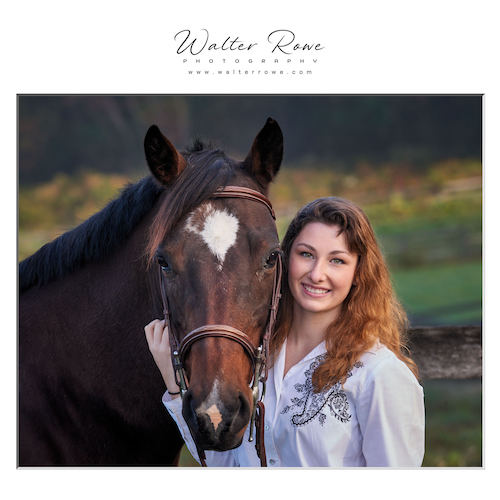

# Examples

## (NEW) Simple solid frame without Watermark

This has a pin-stripe interior border with a plain solid outer border and no watermark.

    

## (NEW) Simple solid frame with Text Watermark on Image

This has a pin-stripe interior border with a plain solid outer border and a text-based watermark placed on the lower left corner of the image.

    

## (NEW) Simple solid frame with Text Watermark on Border

This has a pin-stripe interior border with a plain solid outer border and a text-based watermark on the border centered below the image.

    

## Beveled matte frame with Image Watermark

This has an interior bevel and solid outer border with image-based watermark placed on southwest corner of the image.

    

## Drop-shadow frame with Image Watermark

This has an interior frame with shadow on all edges and solid outer border. It has an image-based watermark centered on the border above of the image.

    

## Shadowed frame with image watermark placed in southeast corner below the image

This has an interior frame with shadow on all edges and solid outer border. It has an image-based watermark placed bottom right of the border below the image.

    

## Beveled matte frame with image watermark placed above the picture and aspect ratio 1:1 (square)

This has an interior bevel and solid outer border with image-based watermark centered on the border above the image.

    

## Beveled matte frame with text watermark placed below the picture and aspect ratio 1:1 (square)

This has an interior bevel and solid outer border with text-based watermark centered on the border below the image and a 1:1 aspect ratio.

    

## Picture frame and beveled matte with image watermark placed below the picture

This has a interior beveled matte and picture frame border with image-based watermark centered on the matte below the picture.

    