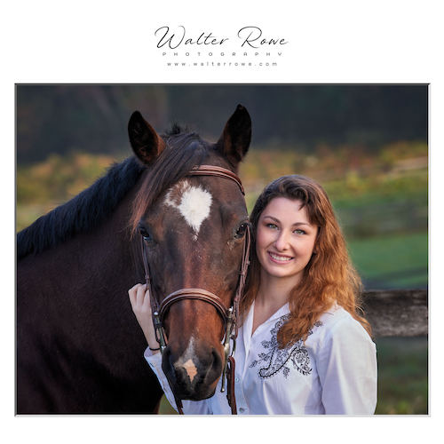
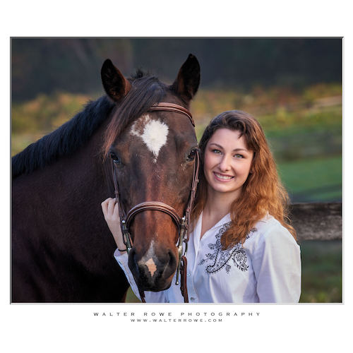

# Examples

- (NEW) Solid frame and interior pin-stripe without any watermark

    

- (NEW) Solid frame and interior pin-stripe with text watermark justified bottom left on the picture

    

- (NEW) Solid frame and interior pin-stripe with image watermark centered below the picture

    

- Beveled matte frame with image watermark placed on southwest corner of the image

    

- Shadowed frame with image watermark placed above the picture

    

- Shadowed frame with image watermark placed in southeast corner below the image

    

- Beveled matte frame with image watermark placed above the picture and aspect ratio 1:1 (square)

    

- Beveled matte frame with text watermark placed below the picture and aspect ratio 1:1 (square)

    

- Picture frame and beveled matte with image watermark placed below the picture

    