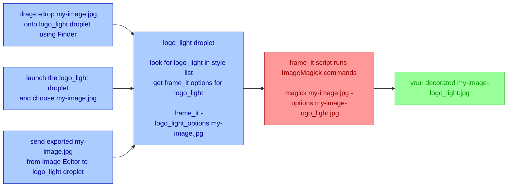

# How Magick Frames Works

This section is primarily for those who want to understand the inner workings of this utility.

The Magick Frames package includes a shell script I wrote called "frame\_it". This shell script uses a free software suite called [ImageMagick](https://imagemagick.org/) to add a picture frame, add a pleasing outer shadow, place a logo or text below or at a specified inside edge of the image, and add a light or dark matte all the way around the edges to create a professional presentation for your photography. This "frame\_it" script hides the complexities of using ImageMagick so you don't have to learn them. This script is where all the "**magick**" happens. You can use this script directly from a command prompt on macOS and Linux. All of the script options are described at the bottom of this page and are displayed if you run "frame\_it" script with no options. The "frame_\it" script by default saves decorated images in a new file with "-frame" inserted before the file extension.

The Magick Frames package also includes an AppleScript that creates macOS "droplets". These droplets make it easy for macOS users to run the "frame\_it" script with specific options. The CreateStyleDroplets AppleScript contains a list of "styles" I developed to produce different looks. The style list includes style names and corresponding command line options for the "frame\_it" script. Opening and running the CreateStyleDroplets script in macOS Script Editor will create droplets for all of the styles defined in the script. Each droplet will be named for the styled look it produces. When one of these style-named droplets runs it looks for its name in the style list and uses the associated options with the "frame\_it" shell script to decorate your images.

These style-named droplets work like any other macOS application. You can drag-n-drop image files into them, double-click them and choose files, or name them in the export settings of image editing tools that support opening exported images with other applications. The style-named droplets save the decorated images in a new file with "-{style name}" inserted before the file extension. This lets you choose multiple styles and each is saved in a separate file.

This diagram illustrates what Magick Frames is doing, but users of the droplets won't see all if this. They will simply drag-n-drop files onto the droplet or double-click the droplet and choose files. The droplet will handle everything else that this diagram illustrates.

The style droplets only runs on macOS. The ImageMagick tools and “frame\_it" shell script run on macOS and Linux.

By default the “frame_it" shell script preserves your input file by saving the decorated image to a new output file with “-framed" inserted  before the extension in the output filename. An input file named ` my-image.jpg ` will have an output a file named ` my-image-framed.jpg `. The droplets use their style name in place of "framed" for the output file name. The output file is always placed in the same folder as the input file. You can tell the shell script to overwrite your input file by adding the ` -o ` or ` --overwrite ` option.

The “frame_it" shell script offers numerous options to tailor the style of decoration around your images. The CreateStyleDroplets AppleScript includes a list of predefined styles and associated options (also documented below). See the command line options section at the end for a detailed description of these options.
