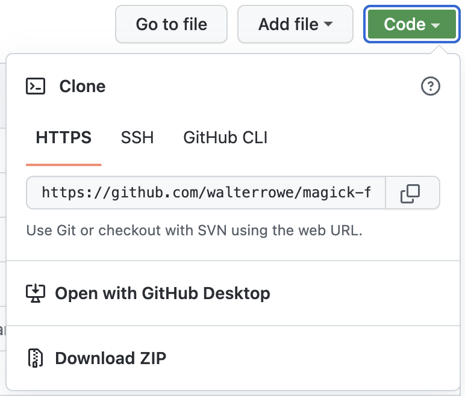

# Magick Frames

**Donations**: if you like this utility and want to support me [buy me a coffee](https://buymeacoffee.com/walterrowe).

Are you looking for a faster, easier way of give your photographs that polished, professional look for your website, social media, and clients? Look no further!

Magick Frames makes it fast and easy to apply various styles of elegant borders from clean and simple to 3-dimensional shadowed borders and frames to a beautiful picture frame:

- (NEW) Support for some common EXIF / IPTC placeholders ("%tag") in text watermarks (see script for full list of supported tags). With this update text labels will auto-wrap when they extend further than the image width (for example with long captions or keyword lists).
 
	- %ISO
	- %ShutterSpeed
	- %Aperture
	- %FocalLength
	- %City
	- %ProvinceState
	- %CountryCode
	- %Title
	- %Caption
	- %Keywords

	The following command produced the image example below it. 

	```
	% ./frame_it -t --label1="%Location, %City, %ProvinceState" --label2="%ISO | %Aperture | %ShutterSpeed | %FocalLength" -g=sw ~/Pictures/Walter_Rowe/WPR-20070520-7946.jpg
	```

	

- (NEW) Simple solid borders have an internal pin-stripe that separates border from picture
- Matted borders have a shadow on all edges, a drop shadow, or a beveled inside matte edge
- Picture frames have an outer "frame", a matte, and an interior beveled edge around your picture
- Matted borders can also be transparent for multi-purpose use

You also have multiple options for applying watermarks:

- (NEW) Simple solid borders can be added with and without watermarks
- You can apply a text- or image-based watermark in all the styles
- You can place watermark on the matte surrounding the picture, or on the picture itself
- Watermarks on the matte can appear above or below the picture, and be left, center, or right justified
- Watermarks on the picture can appear in the center, against any edge, and be left, center, or right justified

Best of all, Magick Frames comes with over 180 predefined looks you can access right from macOS Finder by double-clicking them or drag-n-dropping pictures onto them.
Select your photographs, drop them onto your preferred style applet, and move on to other tasks. Magick Frames will style your photographs and place the decorated versions as new files in the same folder as the files you selected. Each style applet adds its style name to the output filename. This makes it easy to identify what style was used. You can create as many different styled looks as you want for any image, each with their own output file, and always have access to your original file.

Watch this [2-minute introduction video](https://youtu.be/PkRCjbNo11M) to see just how easy it is to use Magick Frames.

You can download and set up Magick Frames in 5-10 minutes.

## December 2024 Update

Support is added for EXIF / IPTC placeholders in text-based watermarks.

The following new options add solid border styles.

- (NEW) Option ` -so ` applies a plain solid border with pin-stripe between picture and border
- (NEW) Option ` -sl ` places an image-based watermark to the plain solid border
- (NEW) Option ` -st ` places an text-based watermark to the plain solid border
- (NEW) Option ` -slo ` places an image-based watermark on an inside edge of the picture
- (NEW) Option ` -sto ` places an text-based watermark on an inside edge of the picture
- (NEW) Option ` -ic ` specifies the color of the interior pin-stripe for solid borders
- (NEW) Option ` -oc ` specifies the color of the exterior border for solid borders
- (CHANGE) Add new styles in the property lists in CreateStyleDroplets.

The width of the solid border will be 1.5 percent in pixels of the length of the longest edge of the picture (ie. a 3000px long edge will have a 45px border). The interior pin-stripe will be 2 pixels wide. You can eliminate the pen-stripe by setting the same value for inner and outer color. If a watermark is added to a solid border then the border on the watermarked edge will be extended to include the watermark.


## Copyrights and Terms of Use

All of the content provided here is written by and the intellectual property of Walter Rowe.

Copyright © 2024 Walter Rowe.

- You may use this utility free of charge.
- No warranties are provided for use of this utility.
- You **may not** incorporate it into any other product.
- You **may not** redistribute it in whole or in part in any way.

Referenced trademarks are the property of their owners.

## Assistance and Support

If you need help, submit a request at my [Buy Me A Coffee](https://buymeacoffee.com/walterrowe/extras) 1-on-1 support page.

If you want to make a donation to support Magick Frames, you can [Buy Me A Coffee](https://buymeacoffee.com/walterrowe).

## Assumptions

- You will need to open a Terminal window to type in commands at a command prompt.
- You will have to install the ImageMagick open source software suite, and edit and copy a script.
- You will have to run an AppleScript to create the built-in style droplets.

If these are unfamiliar terms, use my [Buy Me A Coffee](https://buymeacoffee.com/walterrowe/extras) 1-on-1 support page to set up a one-on-one video call. You will be using Magick Frames in no time.

## Upgrading Magick Frames

Before you upgrade preserve your modified "frame\_it" and CreateStyleDroplet scripts.

1. Make a copy of your modified "frame\_it" script to preserve your defauly text and image watermark values.
1. Make a copy of your modified CreateStyleDroplets to preserve your custom styles to add to the new CreateStyleDroplets.

You are now ready to upgrade.

1. Download Magick Frames again from GitHub.
1. Set your "label1", "label2" text watermark values and image watermark path in "frame\_it"
1. Copy the new version of "frame\_it" it to your /usr/local/bin folder.
1. Copy your custom styles into the new CreateStyleDroplets AppleScript.
1. Run the CreateStyleDroplets AppleScript to recreate all the style droplets.
1. Check any Capture One export recipes to make sure they still see your droplets.

You should now be upgraded to the latest version.

## Installation and Configuration

Installation will ask you to select a folder where you want the included styles installed. After they are installed you can delete any styles you don't want by dragging them into the macOS Trash.

First you have to download Magick Frames to your computer.

1. On the Magick Frames GitHub page press the green "Code" button.
1. On the Code drop-down press choose the option to "Download ZIP".



The default download folder is "Downloads", but you can change that if you have configured your browser to ask. On your computer you may have to double-click the ZIP file in Finder to extract it into its own folder.

## Create Logo Watermarks

These graphic watermark specifications are based on sizing for a 3000w x 2000h pixel image file:

- create a watermark folder (e.g. Pictures/watermarks) and place your watermarks there
- create your watermark files and save them as PNG files in your watermark folder
- size your watermarks 1400 pixels wide and 500 pixels tall with a transparent background
- make a light colored watermark to use on dark mattes and place on dark images (` watermark_light.png `)
- make a dark colored watermark to use on light mattes and place on light images (` watermark_dark.png `)
- place your graphic watermarks in a folder called "watermarks" under your Pictures folder.

You can create many different graphic watermarks. Always create two for each style - one dark and one light.

## Install ImageMagick on macOS

Use these installation instructions (from the [ImageMagick](https://imagemagick.org/) website). The package is available for macOS and many distributions of Linux.

Open a Terminal window and copy/paste or type these commands:

1. Install HomeBrew (this may ask for your password .. that is OK)

    ```shell
    % /bin/bash -c "$(curl -fsSL https://raw.githubusercontent.com/Homebrew/install/HEAD/install.sh)"
    ```

1. Install ImageMagick

    ```shell
	% brew install imagemagick
	```

Linux users can download the package from the ImageMagick website and follow their instructions for installation.

## Install The Shell Script

Use a text editor to edit the [frame_it](frame_it) shell script. You need to set the values for your text-based watermark (called ` label1 ` and ` label2 `), and the location and file name for your default graphic watermark file ( ` watermark `). Look for these lines in the “frame_it" shell script.

```shell
# text option - two text label lines
label1=“W  A  L  T  E  R     R  O  W  E     P  H  O  T  O  G  R  A  P  H  Y"
label2=“w w w . w a l t e r r o w e . c o m"

# default graphic watermark file - graphic watermark (my graphic watermark is 900wx250h pixels w/ transparent background)
watermark=$HOME/Pictures/watermarks/watermark_dark.png
```

Change value after the “=“ sign for “label1" and “label2" to your desired text. Change the value after the “=“ for “watermark" to the folder and filename for your default watermark image file.

Copy the edited [frame_it](frame_it) shell script into your system’s /usr/local/bin folder.

After installing ImageMagick and copying your edited "frame\_it" to /usr/local/bin, you need to test “frame\_it". You will need to use one of your images for testing.

1. Copy a JPG picture to your Desktop and call it "my-image.jpg".
1. Keep your Desktop folder open in Finder.
1. Open a Terminal window and type the following commands.

    ```shell
    % cd $HOME/Desktop
    % frame_it my-image.jpg
    ```

You should see a new file in your Desktop Finder window called ` my-image-framed.jpg `. This confirms everything is working and you can skip to Create The Style Droplets.

In the line above containing ` export `, replace ` /path/to/your/imagemagick ` with the folder containing the ImageMagick tools, uncomment the line (remove the `# ` at the beginning), and re-save the file. You will need to re-copy the script to the /usr/local/bin folder.

## Create The Style Droplets

</img>

The style droplets created on macOS are little apps that work like you expect:

- drag-n-drop files onto the droplet using Finder to decorate the selected files
- double-click the droplet to open a file chooser and decorate the selected files
- add to an export recipe of an image editing tool to decorate images on export

There are two ways to create the droplets for macOS.

### The Easy Way

1. Open the CreateStyleDroplets AppleScript in Script Editor and run it.
1. Choose the folder where you want the droplets and it creates one for every style.

> **Bonus Feature**
>
> When you use this EASY option one SPECIAL style droplet is also created called "**Style Chooser**".
>
> Double-click "Style Chooser" or drop images onto it and it presents a list of all the defined styles. Select multiple styles to easily decorate a set of pictures in multiple looks in one easy step.
>
> If you have added your own custom styles to the CreateStyleDroplets AppleScript, and recreated all the style droplets, then Style Chooser also includes your own custom styles.

Magick Frames includes a large number of style variation droplets. Use the Style Chooser with one of your pictures and select all of the styles. Using your example image you can delete any style droplets you want.

You can customize which sets of styles are automatically created by modifying this line in ` CreateStyleDroplets.applescript `. This line names lists of styles defined above it to include during automatic installation. You can remove any of the items from this definition before running the script to omit them from being installed.

```applescript
property styleDroplets : presetDroplets & solidDroplets & colorDroplets & customDroplets
```

### The Hard Way

1. Open the CreateStyleDroplets AppleScript in Script Editor.
1. Look at the ` styleDroplets ` property of included styles and their associated options.
1. File > Export, choose type Application, and save a droplet named as a desired style.

When a style droplet runs it looks for it's own name in the styles property list and runs the “frame\_it" script with the associated options to decorate your images. For example, if you double-click or drop images onto the the logo_dark droplet, it looks for logo_dark in the style list and passes the logo_dark options to "frame_it" to decorate your images.

Once you have the style droplets created you are ready to use Magick Frames.

## How To Use

The scaling and placement of watermarks and text were developed using an image with dimensions 3000 wide by 2000 high pixels, a font of 64 points, and an image watermark with dimensions 900 wide by 250 high pixels. When creating your own watermark make one with dark text for light backgrounds and another with light text for dark backgrounds.

### In macOS Finder

The AppleScript droplet included with this package works like any other macOS application.

- drag-n-drop files onto the droplet using Finder to decorate the selected files
- double-click the droplet to open a file chooser and decorate the selected files
- add to an export recipe of an image editing tool to decorate images on export

The droplet name controls how the selected images are decorated as described above. The "StyleChooser" droplet will open a dialog where you can select one or more styles. The images will be decorated in the selected style(s) and each output filename will have the specific style's name inserted before the file extension.

### In Capture One Export Recipes

The droplet included with this package can configured into a Capture One Pro Export Recipe like any other application.

1. Go to ` Open With ` field in a Capture One Export Recipe
1. Choose ` Other` from the ` Open With ` drop-down menu
1. Navigate to and select one of your droplet applications
1. Select and check the configured Export Recipe
1. Select images to export and press ` CMD + D ` or the Export button

The droplet name controls how the exported images are decorated.

This is what really happens is on export.

1. The Export Recipe exports your selected images to your designated folder
1. The Export Recipe passes each output filename to the droplet named in "Open with"
1. The droplet passes the correct options and output filename to the “frame\_it" shell script
1. The “frame\_it" shell script decorates your output file using the chosen “frame\_it" options

This process may seem complicated, but it works quickly and invisibly. Open your output folder in Finder icon view before you export, watch as the exported files appear in the folder, and then notice the previews change as they are decorated by “frame\_it".
